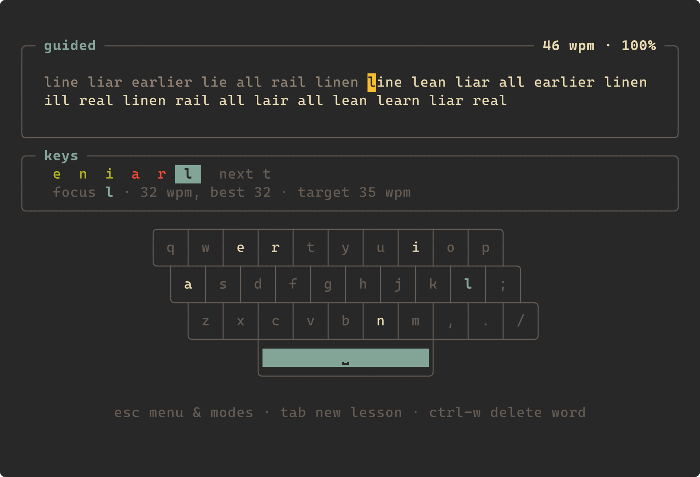
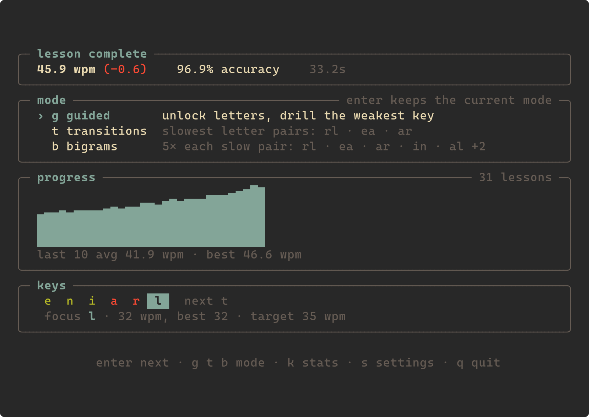
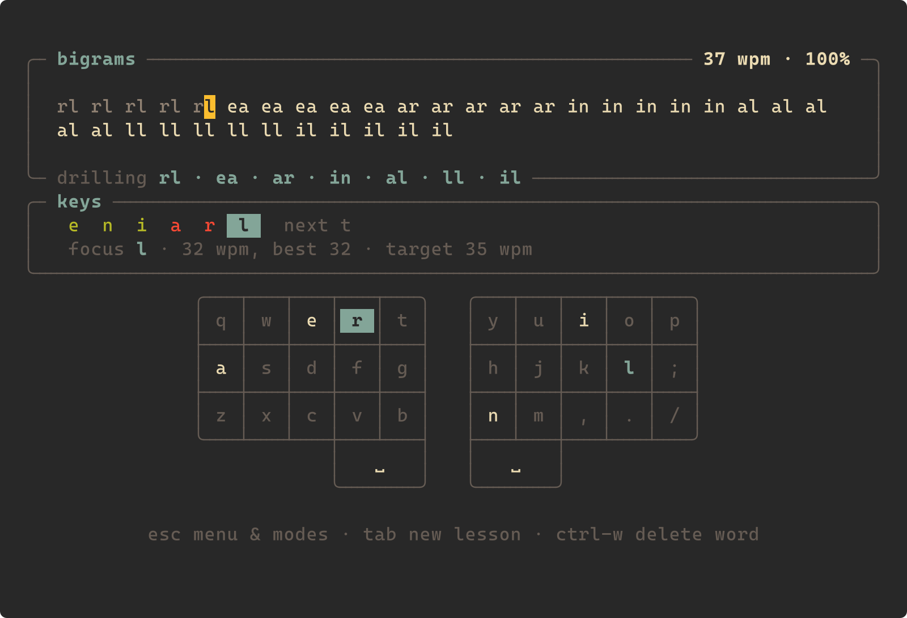
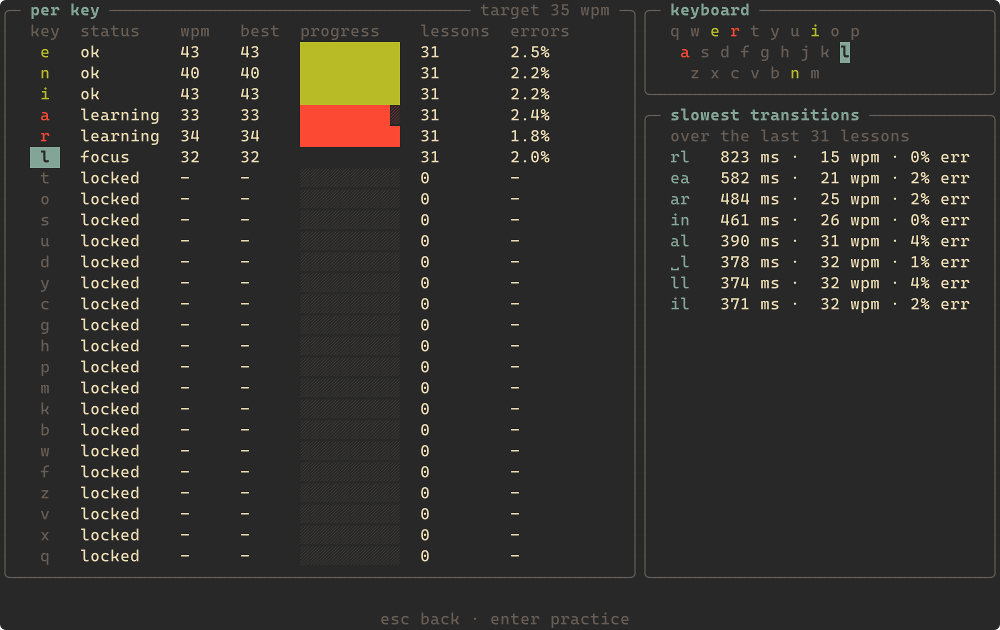
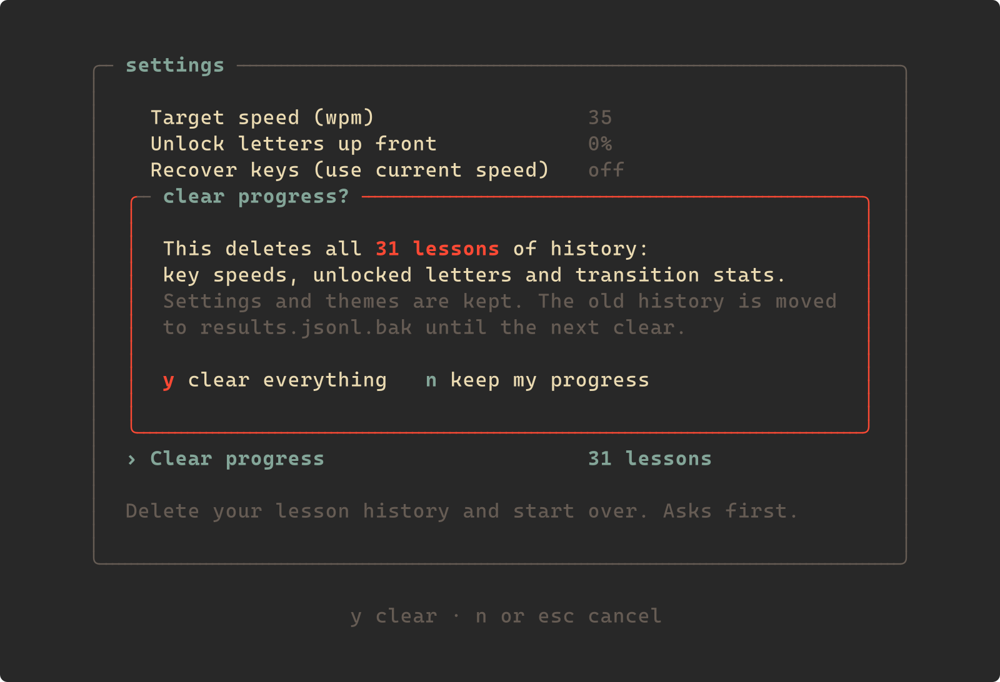

# termtype

Adaptive touch-typing practice in the terminal. termtype ports the learning
engine of [keybr.com](https://www.keybr.com) to Rust and runs it as a TUI.

> termtype was vibe coded with [Claude](https://claude.com/claude-code): most
> of the code was written by Claude under my direction.



- **Guided lessons.** You start with six letters. The next letter unlocks once
  every unlocked key reaches your target speed. Each lesson focuses on your
  weakest key.
- **Text.** Lessons use real words that fit the unlocked letters, with
  keybr's phonetic pseudo-words filling in when there aren't enough.
- **Retype drill.** Optional. A mistake stops the cursor, and the missed
  word must then be typed cleanly N times (default 10) before you move on.
- **Key stats.** Per-key speed and progress, a QWERTY heatmap, and your
  slowest key *transitions* (bigrams) across recent lessons.
- **Transition drills.** Press `t` in the menu for lessons built around your
  3 slowest letter-to-letter transitions over the last 50 lessons. Words take
  turns drilling each pair. A pair needs 10 typings before it counts. Targets
  are recomputed every lesson, so a pair drops off once it gets faster. Press
  `g` to return to guided lessons.
- **Bigram drills.** Press `b` in the menu to type every letter pair that is
  still below your target speed on its own, 5 times each, slowest first
  (`rl rl rl rl rl ea ea …`, up to 12 pairs). Unlocks after 10 lessons, so
  there is enough history to judge your transitions.
- **Mode panel.** The menu lists the three modes, marks the current one (it
  sticks across lessons) and previews the pairs each drill would target.
- **Clear progress.** The last setting deletes your lesson history after a
  confirmation. The old history is moved to `results.jsonl.bak` until the
  next clear.
- **On-screen keyboard.** Boxed keys below the lesson light up as you type
  them (red for a wrong key). Split ergo layout by default; also `standard`
  or `off`. It hides itself when the terminal is too small.
- **Themes.** TOML files with hex colours. Built-ins: `terminal` (uses your
  terminal's palette), `gruvbox`, `catppuccin-mocha`, `nord`.

## Screenshots

The menu after a lesson, with the mode panel:



A bigram drill, typing each slow pair 5 times:



Key stats (`k`), with per-key progress and the slowest transitions:



Clearing progress asks first:



The screenshots are rendered from the real UI with simulated typing:
`cargo run --example screenshots` regenerates them (needs `rsvg-convert`).

## Usage

```sh
cargo install --path .
termtype
```

| Where    | Keys                                                                          |
|----------|-------------------------------------------------------------------------------|
| Typing   | `esc` menu · `tab` new lesson · `ctrl-w` / `ctrl-backspace` delete word · `ctrl-c` quit |
| Menu     | `enter` next lesson · `g` guided · `t` transition drills · `b` bigram drills · `k` key stats · `s` settings · `q` quit |
| Settings | `↑↓` / `j` `k` select · `←→` / `h` `l` / `enter` change · `g` / `G` first / last · `esc` back · on *Clear progress*: `y` confirm, `n` / `esc` cancel |

## Files

| File | Purpose |
|------|---------|
| `~/.config/termtype/config.toml` | settings (also editable in the app) |
| `~/.config/termtype/themes/<name>.toml` | your themes |
| `~/.local/share/termtype/results.jsonl` | lesson history, one JSON object per line |
| `~/.local/share/termtype/results.jsonl.bak` | the history from before the last *Clear progress* |

Per-key statistics are always recomputed from the history, so the history is
the only state that matters.

### config.toml

All keys are optional, and unknown keys are reported as errors.

```toml
theme = "terminal"
keyboard = "split"     # split, standard or off

[lesson]
target_wpm = 35        # a key is learned at this speed
alphabet_size = 0.0    # 0..1: share of locked letters to unlock up front
recover_keys = false   # judge keys by current speed, not best-ever
natural_words = true   # real words when enough fit the unlocked letters
length = 0.0           # 0..1: 100..200 characters
repeat_words = 1       # type each word this many times

[input]
stop_on_error = true
forgive_errors = true      # recover from a skipped/extra key
space_skips_words = false

[drill]
enabled = false
repeat_count = 10
```

### Themes

A theme sets any of these slots. Slots you leave out come from `base`
(default `terminal`).

```toml
base = "gruvbox"

[colors]
background = "#282828"  # or "default" for the terminal background
text       = "#ebdbb2"  # not typed yet
typed      = "#928374"  # typed correctly
error      = "#fb4934"  # mistakes
cursor_fg  = "#282828"
cursor_bg  = "#fabd2f"
accent     = "#83a598"  # headings, focused key
muted      = "#665c54"  # hints, locked keys
good       = "#b8bb26"  # keys at target speed
bad        = "#fb4934"  # keys below target speed
```

Colours can be `#rrggbb`, `#rgb`, ANSI names (`red`, `bright-blue`, …) or
`default`.

## How it relates to keybr

`src/engine/` is a translation of keybr's TypeScript, and its tests reuse
keybr's test vectors. It covers keybr's text input (error forgiveness,
space-skip), histograms, exponential-moving-average key stats, the guided
lesson's unlock/focus rules and the order-4 phonetic Markov model. termtype
differs from keybr in these ways:

- **Random numbers.** keybr seeds lessons with an LCG whose float multiply
  loses precision, so it cycles after about 10k values (220 for some seeds).
  termtype keeps that LCG only for test vectors and uses a proper PRNG for
  lessons.
- **Bigram timings.** termtype also records transition (bigram) timings with
  each result. keybr's algorithm doesn't use them; termtype shows them as
  "slowest transitions" and builds transition and bigram drills from them.
- **Retype drill.** This is termtype's own feature.

Not yet ported: capitals and punctuation in lessons, learning-rate
prediction, layouts other than QWERTY, and languages other than English.

## Acknowledgements

- [keybr.com](https://github.com/aradzie/keybr.com) by Aliaksandr
  Radzivanovich, for the learning engine and assets (see above and `NOTICE`).
- [tukai](https://github.com/hlsxx/tukai) by hlsxx, a terminal typing app
  that influenced termtype.

## License

AGPL-3.0, the same license as keybr.com, from which the algorithms and
`assets/` (phonetic model, word list, blacklist) come. See `NOTICE`.
